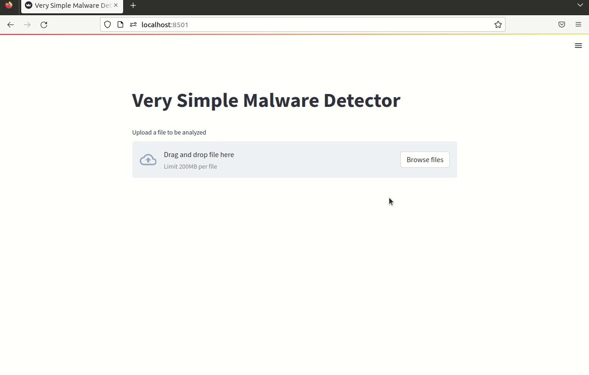

# Very Simple Malware Detector


## Objective

This repository contains the intermediate project for the [ML Zoomcamp](https://github.com/alexeygrigorev/mlbookcamp-code) course provided by [DataTalks.Club](https://datatalks.club/).


## Context

The objective of this project is to develop a very simple malware detector for Windows Portable Executables (PE).


## Dataset

The dataset is read from a CSV file downloaded from Kaggle at this [link](https://www.kaggle.com/code/aashkatrivedi/malware-detector). It contains static analysis data (Top-1000 imported functions) extracted from the 'pe_imports' elements of Cuckoo Sandbox reports. PE malware examples were downloaded from [virusshare.com](https://virusshare.com). PE goodware examples were downloaded from [portableapps.com](https://portableapps.com) and from Windows 7 x86 directories.


## Deployment

The service is dockerised and can be easily deployed via the following steps:

1. Clone the `very-simple-malware-detector` repository locally:

    ```bash
    $ git clone https://github.com/Peco602/very-simple-malware-detector.git
    ```

2. Install the pre-requisites necessary to run the service:

    ```bash
    $ cd very-simple-malware-detector
    $ sudo apt install make
    $ make prerequisites
    ```

    It is also suggested to add the current user to the `docker` group to avoid running the next steps as `sudo`:

    ```bash
    $ sudo groupadd docker
    $ sudo usermod -aG docker $USER
    ```

    then, logout and log back in so that the group membership is re-evaluated.

3. Pull the Docker images:

    ```
    $ make pull
    ```

4. Launch the service:

    ```
    $ make run
    ```

Once ready, the following services will be available:

| Service | Port | Interface | Description |
| --- | --- | --- | --- |
| Flask | 8080 | 0.0.0.0 | API service |
| Streamlit | 8051 | 0.0.0.0 | Web application |


## Testing

The malware detector can be easily tested via the Streamlit web application available at `http://localhost:8051`:



or by sending the samples to be tested directly to the service APIs via `curl`:

```bash
$ curl -F "sample=@./data/nslookup.exe" localhost:8080/predict
{"Outcome":"Benign"}
$ curl -F "sample=@./data/ping.exe" localhost:8080/predict
{"Outcome":"Benign"}
$ curl -F "sample=@./data/Bonzify.exe" localhost:8080/predict
{"Outcome":"Malware"}
```


## Training

The Jupyter notebook `notebook.ipynb` contains the exploratory data analysis and the training experiments. It is worth noting the dataset contains several features (1000 possible function imports) that can increase training complexity thus the attention has also been focused on feature reduction. In detail, the `train.py` script consists of the following steps:

1. Removal of the unused `hash` feature
2. Calculation of the features correlation matrix
3. Removal of the features with a correlation coefficient higher than `0.8`
4. Training of multiple models via `RandomizedSearchCV` among:
    - Support Vector Machine
    - Logistic Regression
    - Decision Tree
    - Random Forest
5. Selection of the best model based on AUC
6. Export of the best model and selected features

Please note that both the `RandomizedSearchCV` and the correlation threshold of `0.8` have been chosen to speed up the training. A more accurate model search could be performed and the correlation threshold could be increased to use additonal features and enhance the malware detection capabilities.

The training can be performed again via the following steps:

1. Configure the development evironment:

    ```bash
    $ make setup
    ```

2. Launch the training script:

    ```bash
    $ make train
    ```


## Disposal

The service can be disposed via:

```
$ make kill
```


## GitHub Actions

- **Continuous Integration**: On every push and pull request on `main` and `dev` branches, the Docker images are built, tested and then pushed to DockerHub.


## Applied technologies

| Name | Scope |
| --- | --- |
| Jupyter Notebooks | Exploratory data analysis and selection of the best model. |
| Docker | Application containerization. |
| Docker-Compose | Multi-container Docker applications definition and running. |
| Flask | Web server. |
| pytest | Python unit testing suite. |
| pylint | Python static code analysis. |
| black | Python code formatting. |
| isort | Python import sorting. |
| Pre-Commit Hooks | Simple code issue identification before submission. |
| GitHub Actions | CI/CD pipelines. |
| Streamlit | Web application |


## Disclaimer

This prediction service has been developed as the intermediate project for the ML Zoomcamp course from DataTalks.Club. It cannot be considered a substitute for a professional anti-malware. Please note the repository contains the `Bonzify.exe` sample which is **malicious** and must be handled with care.
